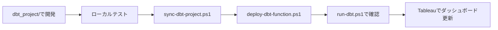

# 不動産価格分析プラットフォーム

[](https://www.getdbt.com/)
[](https://cloud.google.com/bigquery)
[](https://cloud.google.com/functions)

## 📊 プロジェクト概要

日本の不動産取引データ(国土交通省)を用いた、エンドツーエンド分析基盤。
メダリオンアーキテクチャによるデータパイプラインと、
サーバーレス自動化を実装。

### 🎯 目的
- モダンデータスタックの実践的スキル習得
- ポートフォリオとしてのアピール
- データエンジニアリングのベストプラクティス実装

### 🛠️ 技術スタック

| レイヤー | 技術 | 選定理由 |
|---------|------|---------|
| **DWH** | BigQuery | スケーラブル、SQL標準、GCP統合 |
| **変換** | dbt | モジュラー設計、テスト機能、バージョン管理 |
| **自動化** | Cloud Functions | サーバーレス、低コスト、簡単デプロイ |
| **可視化** | Tableau | 業界標準、インタラクティブ性 |

---

## 📁 ディレクトリ構造
```
real-estate-analytics-dbt/
│
├── sync-dbt-project.ps1      # NEW: 同期スクリプト
├── deploy-dbt-function.ps1   # NEW: デプロイスクリプト  
├── run-dbt.ps1               # NEW: 実行スクリプト
├── README.md                 # UPDATED: 完全ドキュメント
│
├── dbt_project/              # 開発環境
│   ├── models/
│   │   ├── sources.yml
│   │   ├── stg_*.sql        # Silver層
│   │   └── marts/           # Gold層
│   ├── macros/
│   └── dbt_project.yml
│
└── dbt-cloud-function/       # 本番環境
    ├── main.py
    ├── requirements.txt
    ├── profiles/
    └── dbt_project/         # 同期される
```

---

## 🚀 クイックスタート

### 前提条件
- Python 3.11+
- dbt-core, dbt-bigquery
- Google Cloud SDK
- GCPプロジェクト(BigQuery API有効化済み)

### セットアップ手順

1. **リポジトリクローン**
```bash
git clone https://github.com/ynom20/real-estate-analytics-dbt.git
cd real-estate-analytics-dbt
```

2. **開発環境でdbt実行**
```bash
cd dbt_project
dbt run
dbt test
```

3. **本番環境へ同期**
```powershell
.\sync-dbt-project.ps1
```

4. **Cloud Functionsへデプロイ**
```powershell
.\deploy-dbt-function.ps1
```

5. **HTTPで実行確認**
```powershell
.\run-dbt.ps1
```

---

## 🏗️ アーキテクチャ
```
[国土交通省CSV] → [BigQuery Bronze層]
                         ↓
                   [dbt Transform]
                   Bronze → Silver → Gold
                         ↓
                   [Tableauダッシュボード]

<実行トリガー>
HTTP POST → Cloud Functions → dbt run (25秒)
```

### データレイヤー設計

| 層 | 目的 | 実装 |
|----|------|------|
| **Bronze** | 生データ保管 | BigQueryテーブル |
| **Silver** | クレンジング済み | `stg_transactions`, `stg_zipcodes` |
| **Gold** | 分析用マート | `fct_transactions`, `dim_addresses`, `dim_dates` |

---

## 📜 管理スクリプト詳細

### 1. sync-dbt-project.ps1
**用途**: 開発環境の変更を本番環境へ同期  
**実行タイミング**: dbtモデル修正後、デプロイ前

### 2. deploy-dbt-function.ps1
**用途**: Cloud Functionsへ自動デプロイ  
**所要時間**: 約3-5分  

### 3. run-dbt.ps1
**用途**: デプロイ済み関数をHTTPで実行  
**実行時間**: 約25秒(5モデル変換)

---

## 🧪 開発ワークフロー


---

## 📈 習得スキル

- ✅ dbt (Medallion Architecture)
- ✅ BigQuery (DWH設計)
- ✅ Cloud Functions (サーバーレス)
- ✅ IAM/ADC (GCP認証)
- ✅ Git/GitHub (Pull Request運用)
- ✅ PowerShell (自動化)

---

## 🔗 リンク

- **Cloud Functions URL**: https://asia-northeast1-real-estate-project-2025.cloudfunctions.net/dbt-runner

---

## 四半期データ更新手順

### Overview

New quarterly transaction data from Japan's Ministry of Land, Infrastructure, Transport and Tourism can be added to the pipeline by loading CSV files into the Bronze layer. Thanks to the ELT architecture, Silver and Gold layers are automatically updated via `dbt run`.

### Prerequisites

- Google Cloud SDK authenticated (`gcloud auth application-default login`)
- CSV file converted from Shift_JIS to UTF-8 (use VS Code: "Save with Encoding" → UTF-8)

### Steps

```powershell
# 1. Authenticate (required if session expired)
gcloud auth application-default login

# 2. Check current state
bq query --use_legacy_sql=false --format=pretty 'SELECT transaction_period, COUNT(*) as count FROM `real-estate-project-2025.real_estate_bronze.raw_land` GROUP BY transaction_period ORDER BY transaction_period DESC'

# 3. Backup existing data
bq cp real_estate_bronze.raw_land real_estate_bronze.raw_land_backup_YYYYMMDD

# 4. Upload CSV (from Raw/ directory)
cd Raw/
bq load --source_format=CSV --skip_leading_rows=1 --encoding=UTF-8 --noreplace real_estate_bronze.raw_land <filename>.csv

# 5. Verify upload
bq query --use_legacy_sql=false --format=pretty 'SELECT transaction_period, COUNT(*) as count FROM `real-estate-project-2025.real_estate_bronze.raw_land` GROUP BY transaction_period ORDER BY transaction_period DESC'

# 6. Run dbt transformations (from dbt_project/ directory)
cd ../dbt_project/
dbt run

# 7. Verify Gold layer
bq query --use_legacy_sql=false --format=pretty 'SELECT EXTRACT(YEAR FROM transaction_date) AS year, EXTRACT(QUARTER FROM transaction_date) AS quarter, COUNT(*) AS record_count FROM `real-estate-project-2025.real_estate_gold.fct_transactions` WHERE transaction_date IS NOT NULL GROUP BY year, quarter ORDER BY year, quarter'

# 8. Git workflow (from repository root)
cd ..
git checkout -b feat/add-latest-quarter-data
git add .
git commit -m "feat(bronze): add latest quarterly transaction data"
git push origin feat/add-latest-quarter-data
# → Create Pull Request on GitHub → Merge
```

### Key Notes

| Topic | Detail |
|-------|--------|
| **Encoding** | MLIT CSV files use Shift_JIS. Convert to UTF-8 before upload. |
| **Append mode** | `--noreplace` flag ensures existing data is preserved. |
| **PowerShell quoting** | Use **single quotes** for `bq query` commands. Backticks inside double quotes are interpreted as escape characters (e.g., `` `r `` becomes carriage return). |
| **Authentication** | Run `gcloud auth application-default login` if `Access Denied` errors occur after extended periods of inactivity. |
| **dbt SQL comments** | Avoid Japanese characters in `.sql` files to prevent encoding errors. Use English comments. |
